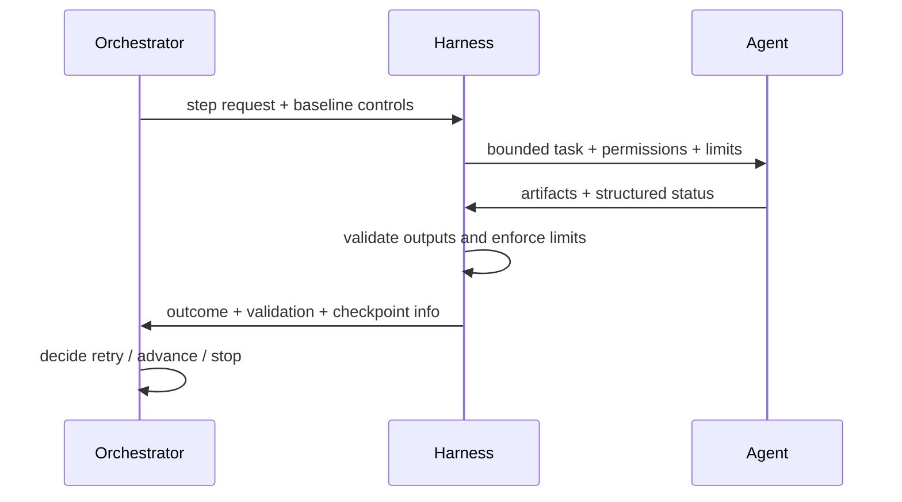

# Communications Protocol Sketch

> **Superseded.** This is an early draft. The authoritative version is at `deep_determinism/communications_protocol_sketch.md` — it has the same content enriched with resolved transport decisions, JSON schemas for StepRequest/StepResult/ErrorEnvelope, normal/timeout/crash sequences, and 7 message validation rules.

This note sketches the messages and contracts between orchestrator, harness, and agents.

Related notes:

- [Orchestrator Idea](orchestrator_idea.md)
- [Orchestrator and Harness](orchestrator_and_harness.md)
- [Workflow Config Sketch](workflow_config_sketch.md)
- [Audit and Ralph State Machine Sketch](audit_and_ralph_state_machine.md)

## Core Principle

The orchestrator speaks in **workflow state**, the harness speaks in **execution controls**, and the agent speaks in **task results**. None of them should depend on freeform chat alone for critical control flow.

## Protocol Layers

### 1. Orchestrator -> Harness

Purpose: tell the harness what bounded step to execute.

Suggested payload:

```yaml
step_id: audit-03
workflow_id: runtime-enforcement
state: audit
phase: 3
agent_profile: contextsmith-auditor
input:
  prompt_file: .agent_work/.../NEXT_PROMPT.md
  task_state_dir: .agent_work/.../tasks/.../
controls:
  permissions: read-only
  step_cap: 10
  validation_mode: strict
  ralph_required: true
  checkpoint_before_run: true
expected_outputs:

  - audit.md
  - STATUS.md
  - PHASE_LOG.md
  - NEXT_PROMPT.md
```

The orchestrator should reject any harness request that omits required baseline controls.

### 2. Harness -> Agent

Purpose: send the bounded task and execution constraints.

Suggested payload:

```yaml
role: contextsmith-auditor
instructions:

  - read STATUS.md first
  - follow NEXT_PROMPT.md
  - write output to audit.md
  - do not skip validation

limits:
  permissions: read-only
  step_cap: 10
  max_tool_calls: 10
  model_pin: qwen36
```

The harness is responsible for enforcing the limits, not merely advertising them.

### 3. Agent -> Harness

Purpose: return artifacts and structured status.

Suggested response:

```yaml
status: pass|fail|blocked
artifacts:

  - audit.md
  - evidence.json

validation:
  schema_passed: true
  tests_passed: false
issues:

  - missing closeout field

next_action: fix|retry|done
```

The harness should capture filesystem artifacts and the structured result. Freeform chat is secondary.

### 4. Harness -> Orchestrator

Purpose: report execution outcome, validation results, and updated artifact locations.

Suggested payload:

```yaml
step_id: audit-03
status: fail
reason: validation_failed
artifacts:

  - audit.md
  - PHASE_LOG.md

validation:
  passed: false
  failures:

    - missing required field: validation_status

checkpoint:
  written: true
  path: .agent_work/.../checkpoint.json
```

The orchestrator uses this to decide whether to retry, transition, or stop.

## Control Flow



## Message Types

### Request types

- `step_request`
- `review_request`
- `validation_request`
- `resume_request`

### Response types

- `step_result`
- `validation_result`
- `review_result`
- `blocked_result`

## Required Fields

The protocol should require these fields for deterministic execution:

- `workflow_id`
- `step_id`
- `state`
- `agent_profile`
- `task_state_dir`
- `permissions`
- `step_cap`
- `checkpoint_before_run`
- `status`
- `artifacts`
- `validation`

## Trust Boundaries

- The agent is not trusted to advance state.
- The harness is trusted to enforce limits and run validation hooks.
- The orchestrator is trusted to own the workflow graph and transition rules.

## Open Choices

- Whether the protocol is JSON over stdin/stdout or file-based YAML/JSON with exit codes
- Whether harness and orchestrator communicate directly or through a shared checkpoint file
- Whether review results are separate from validation results or merged into one structured envelope

## Related Docs

- `workflow_config_sketch.md` for baseline workflow structure
- `audit_and_ralph_state_machine.md` for loop enforcement
- `orchestrator_idea.md` for the system model
- `orchestrator_and_harness.md` for the runtime split
