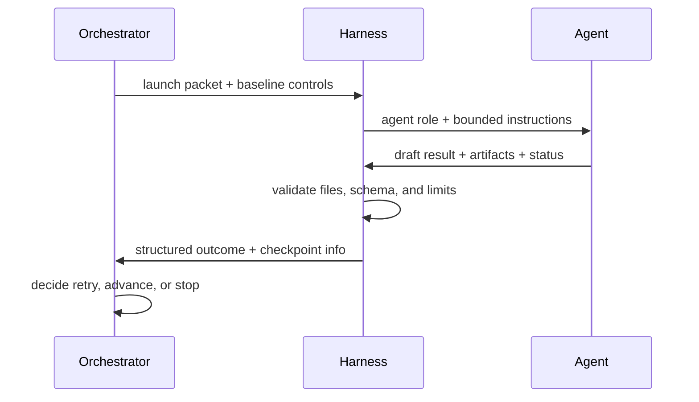

# Agent Startup and Bidirectional Communication

This note explains how the orchestrator starts an OpenCode agent and how the two sides communicate during execution.

The core rule is simple: the orchestrator controls state and transitions, while the agent only handles one bounded task at a time.

**Cross-reference:** `StepContract`, `HarnessResult`, and `HarnessAdapter` are defined in `orchestrator_and_harness.md`. This file defines `LaunchPacket` and the agent-facing communication protocol.

## Purpose

We need a repeatable way to:

- choose the correct agent profile
- pass the right inputs and constraints
- receive structured progress and outputs back
- detect failure, blocking, or completion without relying on freeform chat alone

## Startup Flow

### 1. Orchestrator selects the step

The orchestrator reads the workflow config and task-state files, then selects the next valid step.

Example:

```text
Current phase: validate
Next step: run audit agent
Required artifacts: AUDIT_REPORT.md, CHECKLIST.md, PHASE_LOG.md, NEXT_PROMPT.md
```

### 2. Orchestrator resolves the agent definition

The orchestrator maps the step to an OpenCode agent definition.

Example mapping:

```text
audit step -> @contextsmith-auditor
write step -> @contextsmith-builder
run step -> @contextsmith-runner
```

The agent definition is the runtime envelope. It defines permissions, step caps, and the role identity that OpenCode will execute.

### 3. Orchestrator builds the launch packet

The launch packet contains:

- workflow id
- step id
- agent profile
- input files
- permissions
- step cap
- expected outputs
- validation rules

Example packet:

```yaml
workflow_id: runtime-enforcement
step_id: audit-03
agent_profile: contextsmith-auditor
input:
  prompt_file: .agent_work/.../NEXT_PROMPT.md
  task_state_dir: .agent_work/.../tasks/.../
controls:
  permissions: read-only
  step_cap: 10
  validation_mode: strict
expected_outputs:

  - audit.md
  - AUDIT_REPORT.md
  - PHASE_LOG.md
  - CHECKLIST.md
  - SUMMARY.md
  - NEXT_PROMPT.md
```

### 4. Harness starts the agent

The harness launches the agent with the selected OpenCode profile and the launch packet.

It must enforce:

- permission boundaries
- step limits
- model pinning if configured
- required file access rules

## Bidirectional Communication

Communication happens through three channels:

1. **stdout** — agent output streams to the user in real-time (NOT captured by harness)
2. **filesystem artifacts** — agent writes task files to the state directory
3. **RESULT.json** — agent writes structured status to disk (NOT stdout)

The agent does not print structured results to stdout. It writes `RESULT.json` to the task-state directory. The harness reads this file after the subprocess exits. This separation means stdout is purely for user visibility, and the orchestrator's control channel is the filesystem.

### Orchestrator -> Agent

The orchestrator gives the agent a bounded task.

Example instruction bundle:

```yaml
role: contextsmith-auditor
instructions:

  - read STATUS.md first
  - follow NEXT_PROMPT.md
  - write output to audit.md
  - update CHECKLIST.md as items complete
  - stop after the first blocking issue

limits:
  permissions: read-only
  step_cap: 10
  model_pin: qwen36
```

Useful prompt snippet:

```md
You are auditing the current phase contract.
Return a concise result with: status, findings, required fixes, and next_action.
Do not modify files.
```

### Agent -> Orchestrator

The agent writes structured results to `RESULT.json` on disk, not to stdout. Stdout streams to the user for real-time visibility.

Example RESULT.json (written to task-state directory):

```json
{
  "status": "pass",
  "reason": "All checks passed",
  "artifacts": ["audit.md", "AUDIT_REPORT.md"],
  "issues": [],
  "next_action": "done"
}
```

Example failure RESULT.json:

```json
{
  "status": "blocked",
  "reason": "missing required field: validation_status",
  "artifacts": ["audit.md"],
  "issues": ["missing required field: validation_status"],
  "next_action": "fix"
}
```

The harness reads RESULT.json after the subprocess exits. If RESULT.json is missing, the harness infers status from the exit code and artifact presence.

### Harness as the bridge

The harness sits in the middle and can exchange information in both directions:

- it forwards orchestrator controls to the agent
- it captures agent output and file writes
- it runs validation hooks and tools
- it reports outcome back to the orchestrator

This makes the harness the execution boundary, not the source of truth.

## Recommended Message Sequence



## Example Orchestrator Pseudocode

```python
def run_step(step):
    agent = resolve_agent(step.role)
    packet = build_launch_packet(step, agent)
    result = harness.start(agent=agent, packet=packet)

    if not result.validation_passed:
        return retry_or_block(step, result)

    write_checkpoint(step, result)
    return advance(step, result)
```

## Example Harness Pseudocode

```python
def start(agent, packet):
    enforce_permissions(packet.controls)
    output = run_opencode_agent(agent, packet.input, packet.controls)
    files = collect_artifacts(packet.expected_outputs)
    validation = validate_outputs(files)
    return {
        "status": output.status,
        "artifacts": files,
        "validation": validation,
        "next_action": output.next_action,
    }
```

## Failure Modes

### Agent drifts outside the task

Fix:

- reduce the prompt scope
- lower the step cap
- require a stricter schema for the result

### Harness cannot validate outputs

Fix:

- make required artifacts explicit
- add a validation script or tool
- fail closed instead of guessing

### Orchestrator loses state after interruption

Fix:

- write checkpoints after each confirmed phase
- keep task-state files on disk
- resume from `NEXT_PROMPT.md`

## Relationship to Other Notes

- `communications_protocol_sketch.md` for the protocol envelope
- `orchestrator_and_harness.md` for the runtime split
- `system_components.md` for the full component map
- `state_artifact_strategy.md` for handoff and report artifacts
- `shared/harness-opencode.md` for OpenCode agent, command, and tool definitions

---

## Launch Packet Complete Schema

The launch packet is the data structure the harness uses to start an agent. It is derived from `StepContract` (see `orchestrator_and_harness.md`) and enriched with runtime-specific details.

### Python Dataclass

```python
@dataclass
class LaunchPacket:
    """Complete set of data needed to launch an agent for one bounded step."""

    # Identity
    workflow_id: str
    step_id: str
    run_id: str                    # from checkpoint.json

    # Agent selection
    agent_profile: str             # e.g., "contextsmith-auditor"
    model_pin: Optional[str]       # e.g., "qwen36"

    # Task definition
    prompt_file: str               # path to NEXT_PROMPT.md
    task_state_dir: str            # absolute path
    instructions: list[str]        # step-specific instructions to prepend to prompt

    # Execution limits
    permissions: str               # "read-only" | "edit" | "external-action"
    step_cap: int                  # max tool calls (OpenCode steps)
    timeout_s: int                 # wall-clock timeout

    # Output contract
    expected_outputs: list[str]    # files the agent must produce
    validation_mode: str           # "strict" | "relaxed" | "none"

    # State machine context (for agent awareness, NOT for control)
    current_state: str
    completed_phases: list[str]    # so agent knows what came before

    # Checkpoint controls
    checkpoint_before_run: bool
```

### JSON Serialization (for logging/storage)

```json
{
  "workflow_id": "skill-engineering",
  "step_id": "audit-03",
  "run_id": "550e8400-e29b-41d4-a716-446655440000",
  "agent_profile": "contextsmith-auditor",
  "model_pin": "qwen36",
  "prompt_file": ".agent_work/.../tasks/.../NEXT_PROMPT.md",
  "task_state_dir": "/home/user/project/.agent_work/.../tasks/.../",
  "instructions": [
    "Read STATUS.md first to understand current phase context.",
    "Follow NEXT_PROMPT.md exactly. Do not skip steps.",
    "Write output to audit.md and AUDIT_REPORT.md.",
    "Update CHECKLIST.md as items complete.",
    "Stop after the first blocking issue is found."
  ],
  "permissions": "read-only",
  "step_cap": 10,
  "timeout_s": 300,
  "expected_outputs": [
    "audit.md",
    "AUDIT_REPORT.md",
    "EVIDENCE.md",
    "CHECKLIST.md",
    "PHASE_LOG.md"
  ],
  "validation_mode": "strict",
  "current_state": "audit",
  "completed_phases": ["init", "plan-01", "execute-02"],
  "checkpoint_before_run": true
}
```

---

## Harness.start() Implementation Guide

The `start()` method in the harness adapter follows this exact procedure:

```python
def start(self, agent: str, packet: LaunchPacket) -> HarnessResult:
    """
    Execute one bounded agent step.
    This is the core method of every harness adapter.
    """

    # 1. Validate packet
    self._validate_packet(packet)

    # 2. Resolve agent definition
    agent_def = self._resolve_agent_definition(agent, packet.permissions)

    # 3. Write or update the agent config file (harness-specific)
    agent_config_path = self._write_agent_config(agent_def)

    # 4. Build the subprocess command
    cmd = self._build_agent_command(agent_def, packet)

    # 5. Write instructions to a temp file (for reproducibility)
    instructions_path = Path(packet.task_state_dir) / ".agent_instructions.yaml"
    self._write_instructions_file(instructions_path, packet)

    # 6. Launch subprocess with timeout — stdout streams to user, NOT captured
    try:
        proc = subprocess.run(
            cmd,
            cwd=packet.task_state_dir,

            # No capture_output — agent output streams to user in real-time
            text=True,
            timeout=packet.timeout_s,
            env=self._build_env(packet),
        )
    except subprocess.TimeoutExpired:
        raise HarnessTimeoutError(packet.step_id, packet.timeout_s)

    # 7. Read RESULT.json from disk (agent writes structured result here)
    result_file = Path(packet.task_state_dir) / "RESULT.json"
    envelope = None
    if result_file.exists():
        try:
            envelope = json.loads(result_file.read_text())
        except (json.JSONDecodeError, OSError):
            pass

    # 8. Collect artifacts from disk
    artifacts = self._collect_artifacts(packet.task_state_dir, packet.expected_outputs)

    # 9. Run post-execution validation
    validation = self._run_post_validation(artifacts, packet)

    # 10. Build and return result (envelope from RESULT.json, not stdout)
    return HarnessResult(
        status=self._determine_status(proc, envelope, validation),
        step_id=packet.step_id,
        reason=envelope.get("reason", "") if envelope else f"{len(artifacts)}/{len(packet.expected_outputs)} artifacts produced",
        artifacts=artifacts,
        artifacts_written=list(artifacts.keys()),
        validation=validation,
        issues=envelope.get("issues", []) if envelope else [],
        next_action=envelope.get("next_action", "done") if envelope else "done",
        extra={"exit_code": proc.returncode} if proc else {},
    )
```

---

## Artifact Collection Procedure

After the agent subprocess exits, the harness must find and catalog every file the agent was supposed to produce.

```python
def _collect_artifacts(self, state_dir: str, expected: list[str]) -> dict[str, str]:
    """
    Scan the task-state directory for expected artifacts.
    Returns dict of artifact_name -> content (or error marker).
    """
    artifacts = {}
    base = Path(state_dir)

    for name in expected:
        path = base / name

        if not path.exists():
            artifacts[name] = "__MISSING__"
            continue

        # Security: prevent path traversal in artifact names
        resolved = path.resolve()
        if not str(resolved).startswith(str(base.resolve())):
            artifacts[name] = "__PATH_TRAVERSAL_BLOCKED__"
            continue

        # Size limit: 1 MB per artifact
        if path.stat().st_size > 1_000_000:
            artifacts[name] = f"__TOO_LARGE__ ({path.stat().st_size} bytes)"
            continue

        try:
            artifacts[name] = path.read_text(encoding="utf-8")
        except UnicodeDecodeError:
            artifacts[name] = "__BINARY_FILE__"

    return artifacts
```

### Artifact Validation Rules

| Check | Logic | Pass Condition |
| ------- | ------- | ---------------- |
| File exists | `path.exists()` | True for all expected |
| Non-empty | `path.stat().st_size > 0` | True for all expected |
| No path traversal | resolved path starts with state_dir | True for all |
| Size limit | `< 1 MB` | True for all |
| UTF-8 valid | can decode as UTF-8 | True for text artifacts |
| Schema valid | validate JSON/YAML against schema | True (if schema defined) |

---

## Agent Termination Detection

The harness uses these signals to determine if the agent has completed its task:

### Primary: Subprocess Exit Code

Exit code 0 = agent completed normally. Non-zero = agent encountered an error.

Note: A normal exit does not mean the task was successful — only that the agent process didn't crash. Task success is determined by artifact validation.

### Secondary: RESULT.json on Disk

The agent writes `RESULT.json` to the task-state directory before exiting. The harness reads this file for structured status:

```json
{
  "status": "pass",
  "reason": "All checks passed",
  "artifacts": ["audit.md", "AUDIT_REPORT.md"],
  "issues": [],
  "next_action": "done"
}
```

The harness checks:

- Does RESULT.json exist in the state directory?
- Is it valid JSON?
- Does it contain a `status` field?
- Is `status` one of the allowed values?

If RESULT.json is present, it takes precedence over artifact presence and exit code.

### Tertiary: File Presence

If RESULT.json is missing, the harness relies on filesystem artifact presence to determine success:

```
All expected artifacts exist on disk → status = "pass"
Some expected artifacts missing → status = "fail"
No artifacts written → status = "fail"
```

### Communication Summary

| Channel | Direction | Purpose | Captured? |
| --------- | ----------- | --------- | ----------- |
| stdout | Agent → User | Real-time visibility of agent work | No — streams to user |
| RESULT.json | Agent → Orchestrator | Structured status for state machine | Yes — read from disk |
| Artifacts | Agent → Disk | Task output files | Yes — validated by orchestrator |
| Launch packet | Orchestrator → Agent | Bounded task definition | N/A |

---

## Step Cap Enforcement

Step caps prevent the agent from making infinite tool calls.

### How Step Caps Work

1. The step cap is a limit on the number of tool calls the agent can make in one invocation
2. The cap is set in the `LaunchPacket.step_cap` field (default: 10)
3. The harness communicates the cap to the agent runtime
4. When the cap is reached, the runtime stops the agent (may produce partial output)
5. The harness detects "cap reached" via subprocess stderr or runtime-specific signal

### OpenCode Implementation

**Verified (2026-06-12):** OpenCode does NOT have a `--max-steps` flag. Step limiting is done via:

- Agent config `steps` field in `.opencode/agents/*.md` (e.g., `steps: 10`)
- Prompt instructions ("stop after N tool calls")
- Timeout enforcement in the harness adapter

```
opencode run --agent contextsmith-auditor --file NEXT_PROMPT.md --format json
```

The agent config controls step limits:
```yaml
---
description: Audits prompts, skills, and agent artifacts for reliability
mode: subagent
steps: 10
permission:
  edit: deny
  bash:
    "*": deny
    "python scripts/validate_skills.py": allow
  webfetch: deny
---
```

### Detecting Cap Reached

```python
def _cap_reached(self, proc: subprocess.CompletedProcess, packet: LaunchPacket) -> bool:
    """Check if the agent was stopped by step cap rather than completing naturally."""

    # Check stderr for cap-reached signal
    cap_signals = ["max steps reached", "step limit", "maximum number of steps"]
    for signal in cap_signals:
        if signal in proc.stderr.lower():
            return True

    # If all expected artifacts are present, treat as complete regardless
    all_present = all(
        Path(packet.task_state_dir) / name in proc.stderr  # simplified check
        for name in packet.expected_outputs
    )
    if all_present:
        return False

    # If some artifacts missing and no explicit completion, assume cap reached
    return True
```

### Handling Partial Output on Cap Reached

When the step cap is reached:

1. The harness collects whatever artifacts exist (partial output)
2. The harness returns `status: "fail"` with reason `"step_cap_reached"`
3. The orchestrator decides retry vs. block based on retry counters
4. On retry, the orchestrator may tighten the prompt scope or lower step expectations

---

## Agent Instruction File Format

For reproducibility, the harness writes a structured instructions file before launching the agent. This file serves as the authoriative record of what the agent was asked to do.

```yaml

# .agent_instructions.yaml (written to task_state_dir before agent launch)

step_id: audit-03
workflow_id: skill-engineering

agent:
  profile: contextsmith-auditor
  permissions: read-only
  model_pin: qwen36

task:
  prompt_file: NEXT_PROMPT.md
  instructions:

    - Read STATUS.md first to understand current phase context.
    - "Follow NEXT_PROMPT.md exactly. Do not skip steps."
    - Write findings to AUDIT_REPORT.md.
    - Update CHECKLIST.md as items complete.
    - Stop after the first blocking issue.

limits:
  step_cap: 10
  timeout_s: 300

outputs:
  expected:

    - AUDIT_REPORT.md
    - EVIDENCE.md
    - CHECKLIST.md
    - PHASE_LOG.md

context:
  current_phase: audit
  completed_phases:

    - init
    - plan-01
    - execute-02
```

This file is NOT read by the agent. It is written for:

- Debugging: what exactly was the agent asked to do?
- Audit: can we replay the exact same instruction set?
- Recovery: on crash, what was the agent's task when it died?
