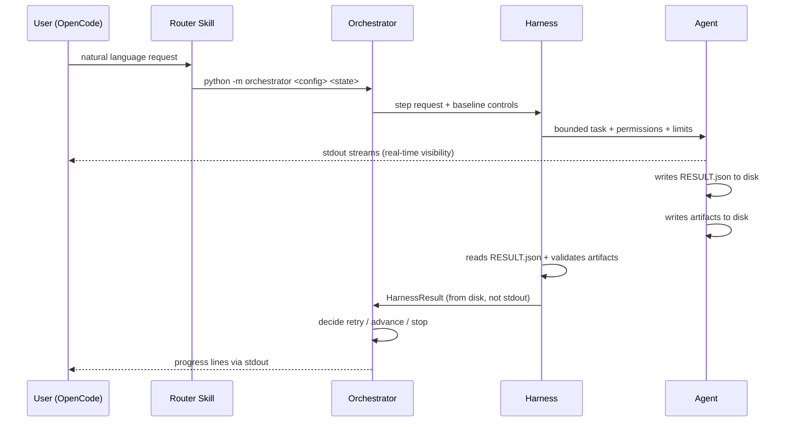

# Communications Protocol Sketch

This note sketches the messages and contracts between orchestrator, harness, and agents.

Related notes:

- [Orchestrator Idea](orchestrator_idea.md)
- [Orchestrator and Harness](orchestrator_and_harness.md)
- [Workflow Config Sketch](workflow_config_sketch.md)
- [Audit and Ralph State Machine Sketch](audit_and_ralph_state_machine.md)

## Core Principle

The orchestrator speaks in **workflow state**, the harness speaks in **execution controls**, and the agent speaks in **task results**. None of them should depend on freeform chat alone for critical control flow.

## Protocol Layers

### 1. Orchestrator -> Harness

Purpose: tell the harness what bounded step to execute.

Suggested payload:

```yaml
step_id: audit-03
workflow_id: runtime-enforcement
state: audit
phase: 3
agent_profile: contextsmith-auditor
input:
  prompt_file: .agent_work/.../NEXT_PROMPT.md
  task_state_dir: .agent_work/.../tasks/.../
controls:
  permissions: read-only
  step_cap: 10
  validation_mode: strict
  ralph_required: true
  checkpoint_before_run: true
expected_outputs:

  - audit.md
  - AUDIT_REPORT.md
  - STATUS.md
  - CHECKLIST.md
  - PHASE_LOG.md
  - ARTIFACTS.md
  - NEXT_PROMPT.md
```

The orchestrator should reject any harness request that omits required baseline controls.

### 2. Harness -> Agent

Purpose: send the bounded task and execution constraints.

Suggested payload:

```yaml
role: contextsmith-auditor
instructions:

  - read STATUS.md first
  - follow NEXT_PROMPT.md
  - write output to audit.md
  - do not skip validation

limits:
  permissions: read-only
  step_cap: 10
  max_tool_calls: 10
  model_pin: qwen36
```

The harness is responsible for enforcing the limits, not merely advertising them.

### 3. Agent -> Harness

Purpose: return artifacts and structured status.

The agent writes structured status to `RESULT.json` on disk (not stdout). Stdout streams to the user for real-time visibility.

RESULT.json (written to task-state directory):

```json
{
  "status": "pass|fail|blocked",
  "reason": "human-readable explanation",
  "artifacts": ["audit.md", "AUDIT_REPORT.md"],
  "issues": ["missing closeout field"],
  "next_action": "fix|retry|done"
}
```

The harness reads RESULT.json after the subprocess exits. If missing, the harness infers status from exit code and artifact presence. Freeform stdout is for the user, not the orchestrator.

### 4. Harness -> Orchestrator

Purpose: report execution outcome, validation results, and updated artifact locations.

Suggested payload:

```yaml
step_id: audit-03
status: fail
reason: validation_failed
artifacts:

  - audit.md
  - PHASE_LOG.md
  - CHECKLIST.md
  - SUMMARY.md

validation:
  passed: false
  failures:

    - missing required field: validation_status

checkpoint:
  written: true
  path: .agent_work/.../checkpoint.json
```

The orchestrator uses this to decide whether to retry, transition, or stop.

## Control Flow



## Message Types

### Request types

- `step_request`
- `review_request`
- `validation_request`
- `resume_request`

### Response types

- `step_result`
- `validation_result`
- `review_result`
- `blocked_result`

## Required Fields

The protocol should require these fields for deterministic execution:

- `workflow_id`
- `step_id`
- `state`
- `agent_profile`
- `task_state_dir`
- `permissions`
- `step_cap`
- `checkpoint_before_run`
- `status`
- `artifacts`
- `validation`

## Trust Boundaries

- The agent is not trusted to advance state.
- The harness is trusted to enforce limits and run validation hooks.
- The orchestrator is trusted to own the workflow graph and transition rules.

## Resolved Protocol Decisions

The open choices from the initial sketch are resolved as follows:

### Transport: In-process Python objects

Orchestrator and harness communicate via in-process Python method calls, not stdin/stdout JSON or file-based messaging. The `HarnessAdapter` abstract class defines `execute(contract, state_dir) -> HarnessResult` as the sole interface.

Rationale:

- The orchestrator and harness adapter share a process boundary for simplicity
- The adapter translates to whatever transport the underlying harness needs (subprocess, HTTP, etc.)
- File-based messaging would add latency and complexity without benefit at this layer
- In-process calls make error handling simpler (try/except instead of parsing exit codes)

### Communication channel: Orchestrator ↔ Harness (direct), Harness ↔ Agent (via subprocess)

The orchestrator and harness communicate through the `HarnessAdapter.execute()` call. The harness communicates with the actual agent runtime through a subprocess (e.g., OpenCode CLI). There is no shared checkpoint file used for live communication — checkpoints are written by the orchestrator after each phase for crash recovery only.

### Review and validation: Same structured envelope

Review results and validation results are merged into a single `HarnessResult` structure. The orchestrator does not distinguish between "review failed" and "validation failed" at the protocol level — both produce `status: "fail"` with different `reason` fields. The workflow config's state transitions distinguish the two by which state produced the result.

---

## Message Schemas (JSON)

All messages between orchestrator and harness are Python dataclass instances (see `orchestrator_and_harness.md` for the Python definition). The JSON schemas below describe the serialized form for logging, debugging, and checkpoint storage.

### StepRequest (orchestrator → harness)

Serialized form of `StepContract` as stored in checkpoints and logs:

```json
{
  "title": "StepRequest",
  "type": "object",
  "required": ["step_id", "state", "agent_profile", "permissions", "timeout_s"],
  "properties": {
    "step_id": {
      "type": "string",
      "description": "Unique step identifier within the workflow run"
    },
    "workflow_id": {
      "type": "string",
      "description": "Workflow config identifier"
    },
    "state": {
      "type": "string",
      "enum": ["init", "plan", "execute", "audit", "fix", "validate",
               "ralph_critique", "ralph_revise", "closeout"],
      "description": "State machine state for this step"
    },
    "agent_profile": {
      "type": "string",
      "description": "Agent profile identifier for the harness"
    },
    "permissions": {
      "type": "string",
      "enum": ["read-only", "edit", "external-action"]
    },
    "inputs": {
      "type": "array",
      "items": {"type": "string"},
      "description": "File paths relative to task_state_dir that the agent may read"
    },
    "expected_outputs": {
      "type": "array",
      "items": {"type": "string"},
      "description": "File paths relative to task_state_dir the agent must write"
    },
    "timeout_s": {
      "type": "integer",
      "minimum": 1,
      "description": "Wall-clock timeout in seconds"
    },
    "max_retries": {
      "type": "integer",
      "minimum": 0
    },
    "ralph_max_cycles": {
      "type": "integer",
      "minimum": 0
    },
    "validation_mode": {
      "type": "string",
      "enum": ["strict", "relaxed", "none"]
    },
    "model_pin": {
      "type": ["string", "null"],
      "description": "Harness-specific model name to use"
    },
    "task_state_dir": {
      "type": "string",
      "description": "Absolute path to the task-state directory on disk"
    }
  }
}
```

### StepResult (harness → orchestrator)

Serialized form of `HarnessResult` as stored in checkpoints and logs:

```json
{
  "title": "StepResult",
  "type": "object",
  "required": ["status", "step_id", "artifacts_written"],
  "properties": {
    "status": {
      "type": "string",
      "enum": ["pass", "fail", "blocked", "timeout", "error"],
      "description": "Execution outcome"
    },
    "step_id": {
      "type": "string",
      "description": "Matches the StepRequest.step_id"
    },
    "reason": {
      "type": "string",
      "description": "Human-readable explanation of the outcome"
    },
    "artifacts_written": {
      "type": "array",
      "items": {"type": "string"},
      "description": "File paths that were actually written to disk"
    },
    "validation": {
      "type": "object",
      "properties": {
        "passed": {"type": "boolean"},
        "schema_valid": {"type": "boolean"},
        "command_exit_codes": {
          "type": "object",
          "additionalProperties": {"type": "integer"}
        },
        "file_checks": {
          "type": "object",
          "additionalProperties": {"type": "boolean"}
        },
        "failures": {
          "type": "array",
          "items": {"type": "string"}
        }
      }
    },
    "issues": {
      "type": "array",
      "items": {"type": "string"},
      "description": "Issues discovered during execution"
    },
    "next_action": {
      "type": "string",
      "enum": ["done", "retry", "fix", "stop"],
      "description": "Agent's suggested next action (orchestrator may override)"
    },
    "exit_code": {
      "type": "integer",
      "description": "Subprocess exit code if applicable"
    }
  }
}
```

### ErrorEnvelope (harness → orchestrator, on harness failure)

Used when the harness itself encounters an error (not the agent):

```json
{
  "title": "ErrorEnvelope",
  "type": "object",
  "required": ["error_type", "step_id", "message"],
  "properties": {
    "error_type": {
      "type": "string",
      "enum": ["timeout", "harness_crash", "permission_denied",
               "agent_not_found", "invalid_config", "internal_error"]
    },
    "step_id": {
      "type": "string"
    },
    "message": {
      "type": "string",
      "description": "Detailed error description"
    },
    "details": {
      "type": "object",
      "description": "Error-specific structured data"
    }
  }
}
```

---

## Protocol Flow (Exact Sequence)

### Normal Execution

```
1. Orchestrator compiles StepRequest from:
   - workflow config → state definition for current phase
   - STATUS.md → current_phase
   - PLAN.md → phase ordering
   - checkpoint.json → retry counters

2. Orchestrator calls harness_adapter.execute(step_request, state_dir)

3. Harness adapter:

   a. Validates that step_request has all required fields → reject if missing
   b. Translates permissions into harness-native controls
   c. Launches agent subprocess with:

      - Agent profile (from step_request.agent_profile)
      - Input files (from step_request.inputs, read from disk)
      - Timeout (subprocess.run(timeout=step_request.timeout_s))
      - Step cap (if supported by harness)

   d. Waits for subprocess completion
   e. Scans state_dir for expected_outputs
   f. Runs post-execution validation (file checks, schema checks)
   g. Returns HarnessResult

4. Orchestrator:

   a. Checks HarnessResult.status
   b. If fail: increments retry counter, checks max_retries
   c. Applies state transition rules to determine next step
   d. Writes checkpoint.json
   e. Updates STATUS.md, PHASE_LOG.md
   f. Generates NEXT_PROMPT.md for next step
   g. Returns exit code (2 = continue, 0/1 = done/blocked)
```

### Timeout Sequence

```
1. Orchestrator calls adapter.execute() with timeout_s=300
2. Adapter launches subprocess with subprocess.run(timeout=300)
3. Agent does not complete within 300 seconds
4. subprocess.TimeoutExpired raised
5. Adapter catches it, raises HarnessTimeoutError
6. Orchestrator catches HarnessTimeoutError:

   a. Kills subprocess (proc.kill())
   b. Logs timeout event
   c. Records error in checkpoint.json errors array
   d. Increments retry counter
   e. If retries < max_retries → retry same state
   f. If retries >= max_retries → blocked
```

### Crash Recovery Sequence (no checkpoint between phases)

```
1. Orchestrator starts, finds checkpoint.json from previous run
2. Checkpoint shows phase "audit-03" was in progress
3. Orchestrator checks phase_started and last_updated timestamps
4. If gap > 5 minutes → assumes crash
5. Orchestrator determines resume action:

   a. If phase was "init", "plan", "closeout" → retry from start (idempotent)
   b. If phase was "execute", "fix", "ralph_revise" → retry from start (non-idempotent,
      previous partial output is discarded)
   c. If phase was "audit", "validate", "ralph_critique" → retry from start (read-only, safe)

6. Orchestrator updates STATUS.md, checkpoint.json to reflect retry state
7. Returns exit code 2 (continue)
```

---

## Message Validation Rules

Both orchestrator and harness enforce these rules on every message:

1. **Required fields**: Every message must contain all fields marked "required" in the schema. Missing fields cause immediate rejection.
2. **Field types**: Every field must match its declared type. Type mismatches are logged and cause rejection.
3. **Enum values**: String fields with declared enums must use exactly one of the allowed values. Unknown values cause rejection.
4. **Path safety**: File paths in `inputs` and `expected_outputs` must not contain `..` or absolute paths. They must be relative to `task_state_dir`.
5. **Size limits**: Individual artifact content is limited to 1 MB. Larger artifacts are truncated with a warning.
6. **Encoding**: All text data must be UTF-8 encoded. Non-UTF-8 data is replaced with a placeholder marker.
7. **Idempotency key**: Each StepRequest carries an implicit idempotency key (`workflow_id + step_id + retry_count`). The harness may use this to detect duplicate submissions.

---

## Communication Contract Summary

| Aspect | Decision |
| -------- | ---------- |
| User entry point | Router skill in OpenCode (user never leaves harness) |
| Orchestrator entry | Router calls `python -m orchestrator` via bash tool |
| Transport | In-process Python method call (orchestrator ↔ harness) |
| Agent output | stdout streams to user (NOT captured) |
| Agent structured result | RESULT.json on disk (NOT stdout) |
| Message format | Python dataclass (serialized to JSON for logging) |
| Failure signaling | Exception (HarnessTimeoutError, HarnessExecutionError) or structured result (HarnessResult) |
| Timeout enforcement | subprocess.run(timeout=...) in adapter |
| Crash recovery | Checkpoint file on disk, read at startup |
| User interrupt | Ctrl-C (SIGINT) or STOP file between phases |
| Agent communication | Subprocess stdout (streaming) + filesystem (artifacts + RESULT.json) |
| Result granularity | One HarnessResult per step (from RESULT.json or inferred) |
| Retry detection | checkpoint.json counters + step_id |
