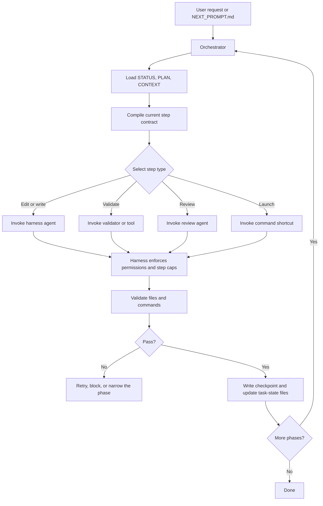

# Orchestrator and Harness: How Implementation Plans Run

Use this note when thinking through how ContextSmith should execute a phased implementation plan from a `NEXT_PROMPT.md` handoff. The orchestrator owns the workflow, while the harness executes each bounded step.

**Canonical definitions:** This file is the authoritative source for `StepContract`, `HarnessResult`, `HarnessAdapter`, `HarnessRegistry`, `HarnessTimeoutError`, and `HarnessExecutionError`. Other files may reference these types but should not redefine them.

## The Big Idea

The orchestrator decides **what happens next**. The harness decides **how the step is executed**. The agent should never be responsible for holding the whole workflow in memory.

This split makes long runs more reliable:

- the orchestrator tracks state, retries, checkpoints, and phase transitions
- the harness enforces permissions, step limits, and validation hooks
- the agent performs one bounded task and writes artifacts to disk

The baseline workflow definition should live in YAML or JSON config so the orchestrator can enforce required steps even when a plan artifact is incomplete.

## What Each Layer Does

| Layer | Responsibility | Example |
|---|---|---|
| Orchestrator | Workflow graph, retries, resume, loop detection | Move from `audit` to `fix` only after validation passes |
| Harness | Agent execution, permissions, tool hooks, step caps | Run the audit agent with read-only access |
| Agent | One bounded task | Write audit findings to `audit.md` |
| Validators | Check outputs on disk | Verify required files and command exit codes |

## Example Input

A user might run something like:

```text
/contextsmith run the prompt in this file: /home/frank/00-Code/ContextSmith/.agent_work/sprints/runtime-enforcement/tasks/YYYY-mm-dd-runtime-enforcement/NEXT_PROMPT.md
```

That looks like a simple prompt, but behind the scenes it is a structured handoff. The system should treat it as a resumable workflow, not a one-off chat request.

## Behind the Scenes

1. The router selects `contextsmith-run`.
2. The run skill detects that the input is a task-state handoff.
3. The orchestrator loads `STATUS.md`, `PLAN.md`, and `CONTEXT.md`.
4. The orchestrator compiles the current phase contract.
5. The orchestrator selects the next state and matching harness profile.
6. The harness invokes the agent with permissions and step caps.
7. The agent writes files, not just chat output.
8. Validators check the artifacts.
9. The orchestrator records closeout state and writes the next handoff.
10. The workflow either advances, retries, or stops.

## Flowchart



## What Changes on Disk

For a phased implementation plan, the workflow should keep task state in `.agent_work/sprints/.../tasks/.../` and update it as it runs.

Typical files:

- `TASK.md` - objective, scope, constraints
- `PLAN.md` - phase checklist and validation gates
- `STATUS.md` - current phase and next action
- `CONTEXT.md` - known facts and file map
- `DECISIONS.md` - durable decisions and reasons
- `CHECKLIST.md` - phase or task checklist with statuses
- `ARTIFACTS.md` - changed files and commands
- `EVIDENCE.md` - proof used for validation or review
- `PHASE_LOG.md` - compact phase history
- `AUDIT_REPORT.md` - user-facing review output when relevant
- `EDUCATIONAL_REPORT.md` - user-facing explanation of what changed
- `SUMMARY.md` - short closeout note for the user
- `NEXT_PROMPT.md` - next-phase handoff prompt

## Common Failure Modes

| Problem | Fix |
|---|---|
| Agent tries to hold the whole workflow in memory | Move workflow control into the orchestrator |
| Phase output is valid but workflow advances too early | Add a validator or tool gate |
| Agent loops on the same mistake | Add step caps and loop detection |
| Resume loses context after interruption | Persist state in task files and checkpoints |
| Harness allows unsafe actions | Tighten permissions or add a plugin hook |

## Where This Fits

This note complements the runtime enforcement docs:

- use `RUNTIME_ENFORCEMENT.md` for operational workflow rules
- use this note for the architecture of orchestrator + harness execution
- use `RUN_TASK_STATE_HANDOFF.md` for the current `NEXT_PROMPT.md` handoff flow
- use `workflow_config_sketch.md` for the baseline workflow config shape
- use `audit_and_ralph_state_machine.md` for enforced audit/Ralph loop behavior
- use `communications_protocol_sketch.md` for the message flow between orchestrator, harness, and agent

---

## Harness Protocol Interface

The harness adapter is the bridge between the orchestrator and the execution runtime. Every harness adapter must implement this interface.

### Python Abstract Base Class

```python
from abc import ABC, abstractmethod
from pathlib import Path
from dataclasses import dataclass, field
from typing import Optional

@dataclass
class StepContract:
    """Bounded step definition compiled by the orchestrator."""
    step_id: str
    state: str
    agent_profile: str
    permissions: str                 # "read-only" | "edit" | "external-action"
    inputs: list[str]               # file paths relative to state_dir
    expected_outputs: list[str]     # file paths relative to state_dir
    timeout_s: int                  # wall-clock timeout in seconds
    max_retries: int
    ralph_max_cycles: int = 0
    validation_mode: str = "strict" # "strict" | "relaxed" | "none"
    model_pin: Optional[str] = None # model name to pin (harness-specific)
    checkpoint_before_run: bool = False
    prompt_template: Optional[str] = None  # override NEXT_PROMPT.md if set
    workflow_id: str = ""
    task_state_dir: str = ""        # absolute path to task-state directory
    extra: dict = field(default_factory=dict)  # harness-specific extensions

@dataclass
class HarnessResult:
    """Structured result returned by the harness after execution."""
    status: str                     # "pass" | "fail" | "blocked" | "timeout" | "error"
    step_id: str
    reason: str                     # human-readable explanation
    artifacts: dict[str, str]       # artifact_name -> content (or path)
    artifacts_written: list[str]    # file paths that were actually written
    validation: dict                # validation results
    issues: list[str]               # issues found during execution
    next_action: str                # "done" | "retry" | "fix" | "stop"
    extra: dict = field(default_factory=dict)

class HarnessAdapter(ABC):
    """Base class for all harness adapters."""

    @property
    @abstractmethod
    def name(self) -> str:
        """Unique harness identifier. Must match the 'harness' field in workflow config."""
        ...

    @abstractmethod
    def validate_environment(self) -> list[str]:
        """
        Check that the harness runtime is available.
        Returns a list of error messages. Empty list = environment is ready.
        """
        ...

    @abstractmethod
    def execute(self, contract: StepContract, state_dir: Path) -> HarnessResult:
        """
        Execute one bounded step.

        This method:
        1. Translates the StepContract into harness-native commands
        2. Launches the agent or runtime (stdout streams to user, NOT captured)
        3. Waits for completion or timeout
        4. Reads RESULT.json from state_dir for structured status
        5. Collects artifacts from disk
        6. Returns a structured result

        Agent output streams to stdout for real-time user visibility.
        The agent writes its structured result to RESULT.json on disk.
        If RESULT.json is missing, the harness infers status from exit code
        and artifact presence.

        Must raise HarnessTimeoutError on timeout.
        Must raise HarnessExecutionError on harness-level failure.
        """
        ...

    @abstractmethod
    def cancel(self, step_id: str) -> bool:
        """
        Attempt to cancel a running step. Returns True if cancellation was
        confirmed, False if the step could not be cancelled.
        """
        ...

    def get_capabilities(self) -> dict:
        """
        Return what this harness supports. Used for capability negotiation.
        """
        return {
            "supports_model_pinning": False,
            "supports_step_caps": True,
            "supports_permission_levels": True,
            "max_concurrent_steps": 1,
        }
```

### Base Implementation

Every adapter must:
1. Inherit from `HarnessAdapter`
2. Implement `name`, `validate_environment`, `execute`, `cancel`
3. Register itself by calling `HarnessRegistry.register()` at module import time
4. Handle timeouts by raising `HarnessTimeoutError` (not by returning a result)
5. Handle harness crashes by raising `HarnessExecutionError`

### Error Types

```python
class HarnessTimeoutError(Exception):
    """Raised when the harness exceeds the step timeout."""
    def __init__(self, step_id: str, timeout_s: int):
        self.step_id = step_id
        self.timeout_s = timeout_s
        super().__init__(f"Step {step_id} timed out after {timeout_s}s")

class HarnessExecutionError(Exception):
    """Raised when the harness itself fails (not the agent)."""
    def __init__(self, step_id: str, reason: str):
        self.step_id = step_id
        self.reason = reason
        super().__init__(f"Harness execution error for {step_id}: {reason}")
```

---

## Harness Registry

The orchestrator discovers adapters through a registry.

```python
class HarnessRegistry:
    _adapters: dict[str, HarnessAdapter] = {}

    @classmethod
    def register(cls, adapter_class: type[HarnessAdapter]) -> None:
        """Register a harness adapter instance. Called at module import time."""
        instance = adapter_class()
        cls._adapters[instance.name] = instance

    @classmethod
    def get(cls, name: str) -> HarnessAdapter:
        """Get a registered adapter by name. Raises KeyError if not found."""
        if name == "auto":
            return cls._detect_auto()
        if name not in cls._adapters:
            raise KeyError(f"No harness adapter registered for '{name}'")
        return cls._adapters[name]

    @classmethod
    def list_available(cls) -> list[str]:
        """Return list of registered adapter names."""
        return list(cls._adapters.keys())

    @classmethod
    def _detect_auto(cls) -> HarnessAdapter:
        """Auto-detect: check environment for known harness runtimes."""
        # 1. Check if running inside OpenCode (OPencode_API env var)
        # 2. Check for ACP environment variables
        # 3. Default to generic (file-based, no agent runtime)
        for name, adapter in cls._adapters.items():
            errors = adapter.validate_environment()
            if not errors:
                return adapter
        raise HarnessExecutionError("auto", "No harness adapter available")
```

---

## Subprocess Communication Model

The orchestrator and harness communicate via a subprocess boundary for isolation.

### Launch Sequence

```
1. Orchestrator: import harness adapter (in-process Python library)
2. Orchestrator: call adapter.validate_environment()
3. Orchestrator: call adapter.execute(step_contract, state_dir)
4. Adapter: launch agent as subprocess (e.g., OpenCode CLI)
5. Adapter: wait for subprocess completion with timeout
6. Adapter: collect artifacts from disk
7. Adapter: return HarnessResult to orchestrator
8. Orchestrator: process result, advance state machine
```

### Key Rule

The adapter runs IN-PROCESS with the orchestrator. The harness runtime (e.g., OpenCode) runs as a SUBPROCESS launched by the adapter. This means:

- The orchestrator process controls the subprocess lifecycle
- Timeout enforcement happens in the adapter via `subprocess.run(timeout=...)`
- The adapter can inspect files between agent steps
- The orchestrator is blocked during agent execution (single-threaded, synchronous)

### Timeout Enforcement

```python
def execute(self, contract: StepContract, state_dir: Path) -> HarnessResult:
    try:
        # Launch agent as subprocess — stdout streams to user, NOT captured
        proc = subprocess.run(
            self._build_command(contract),
            cwd=state_dir,
            # No capture_output — agent output streams to user in real-time
            text=True,
            timeout=contract.timeout_s,
            env=self._build_env(contract),
        )
    except subprocess.TimeoutExpired:
        raise HarnessTimeoutError(contract.step_id, contract.timeout_s)

    # Read structured result from RESULT.json on disk
    # (agent writes RESULT.json, not stdout envelope)
    return self._read_result(proc, contract, state_dir)
```

---

## OpenCode Adapter Specifics

The OpenCode adapter is the default harness. It translates step contracts into OpenCode agent invocations.

### Agent Profile Mapping

| StepContract.permissions | Permissions | OpenCode Agent Config |
|---|---|---|
| "read-only" | `edit: deny`, `bash: deny` (except known scripts), `webfetch: deny` | contextsmith-auditor |
| "edit" | `edit: allow`, `bash: allow`, `external_directory: deny` | contextsmith-builder |
| "external-action" | `edit: allow`, `bash: allow`, `external_directory: allow` | contextsmith-migrator |

### Command Construction

The adapter constructs the OpenCode invocation. **Verified against OpenCode CLI (2026-06-12):**

| Assumed Flag | Actual Flag | Status |
|---|---|---|
| `--agent` | `--agent` | ✅ Exists |
| `--model` | `--model` / `-m` | ✅ Exists |
| `--prompt-file` | `--file` / `-f` | ⚠️ Different name, attaches file |
| `--max-steps` | N/A | ❌ Does not exist |
| `--prompt` | `--prompt` | ✅ Exists (on `opencode run`) |
| `--format json` | `--format json` | ✅ Exists (on `opencode run`) |

**Note:** `--max-steps` does not exist in OpenCode. Step limiting must be done via:
- Agent config `steps` field (in `.opencode/agents/*.md`)
- Prompt instructions ("stop after N tool calls")
- Timeout enforcement in the adapter

```python
def _build_command(self, contract: StepContract) -> list[str]:
    cmd = ["opencode", "run"]

    if contract.agent_profile:
        cmd.extend(["--agent", contract.agent_profile])

    if contract.model_pin:
        cmd.extend(["--model", contract.model_pin])

    # Build initial prompt from NEXT_PROMPT.md
    prompt_path = Path(contract.task_state_dir) / "NEXT_PROMPT.md"
    if contract.prompt_template:
        cmd.extend(["--prompt", contract.prompt_template])
    elif prompt_path.exists():
        cmd.extend(["--file", str(prompt_path)])

    # Use JSON format for structured output
    cmd.extend(["--format", "json"])

    return cmd
```

### Result Parsing

After the agent subprocess exits, the adapter:

1. Scans `expected_outputs` from the step contract
2. For each expected file, checks if it exists on disk
3. Reads `RESULT.json` from the state directory (agent writes this)
4. Falls back to artifact presence + exit code if RESULT.json is missing
5. Returns `HarnessResult` with artifacts and validation status

```python
def _read_result(self, proc: subprocess.CompletedProcess, contract: StepContract, state_dir: Path) -> HarnessResult:
    artifacts = {}
    artifacts_written = []

    for artifact_name in contract.expected_outputs:
        artifact_path = Path(state_dir) / artifact_name
        if artifact_path.exists():
            artifacts[artifact_name] = artifact_path.read_text()
            artifacts_written.append(artifact_name)

    # Read structured result from RESULT.json (agent writes this to disk)
    result_file = Path(state_dir) / "RESULT.json"
    envelope = None
    if result_file.exists():
        try:
            envelope = json.loads(result_file.read_text())
        except (json.JSONDecodeError, OSError):
            pass  # treat as missing

    # Determine status: RESULT.json takes precedence, then artifact presence, then exit code
    if envelope:
        status = envelope.get("status", "pass")
    elif proc.returncode != 0:
        status = "fail"
    elif len(artifacts_written) == len(contract.expected_outputs):
        status = "pass"
    elif len(artifacts_written) > 0:
        status = "fail"  # partial output
    else:
        status = "fail"  # no output

    return HarnessResult(
        status=status,
        step_id=contract.step_id,
        reason=envelope.get("reason", "") if envelope else f"{len(artifacts_written)}/{len(contract.expected_outputs)} artifacts produced",
        artifacts=artifacts,
        artifacts_written=artifacts_written,
        validation={"files_found": len(artifacts_written), "expected": len(contract.expected_outputs)},
        issues=envelope.get("issues", []) if envelope else [],
        next_action=envelope.get("next_action", "done") if envelope else "done",
    )
```

---

## Error Propagation

Errors flow through three layers. Each layer adds context.

### Layer 1: Agent Error

The agent produces invalid output (missing files, wrong format, etc.). The harness captures this in the HarnessResult. The orchestrator decides retry vs. block.

```
Agent → produces broken output → Harness detects missing files → returns HarnessResult(status="fail")
  → Orchestrator checks retry counter → retries or blocks
```

### Layer 2: Harness Error

The harness runtime fails (OpenCode crashes, network error, permission denied). The adapter raises HarnessExecutionError.

```
Harness → OpenCode crashes → subprocess returns non-zero → HarnessExecutionError raised
  → Orchestrator catches exception → logs error → transitions to blocked
```

### Layer 3: Orchestrator Error

The orchestrator itself encounters an error (config invalid, disk full, state inconsistency). This is handled by the orchestrator's own error handling (see orchestrator_idea.md error matrix).

```
Orchestrator → config validation fails → exits with code 3
Orchestrator → state inconsistency → exits with code 4
Orchestrator → internal exception → exits with code 5
```

### No Cascading Failures

A harness crash must never corrupt orchestrator state. The checkpoint file is written BEFORE the harness executes (if `checkpoint_before_run` is true) and AFTER successful validation. If the harness crashes between these two points, the orchestrator restores from the pre-execution checkpoint.

### No Silent Failures

Every error path produces:
1. A log entry (structured, timestamped)
2. An error entry in checkpoint.json
3. A STATUS.md update with the blocking condition
4. A non-zero exit code
