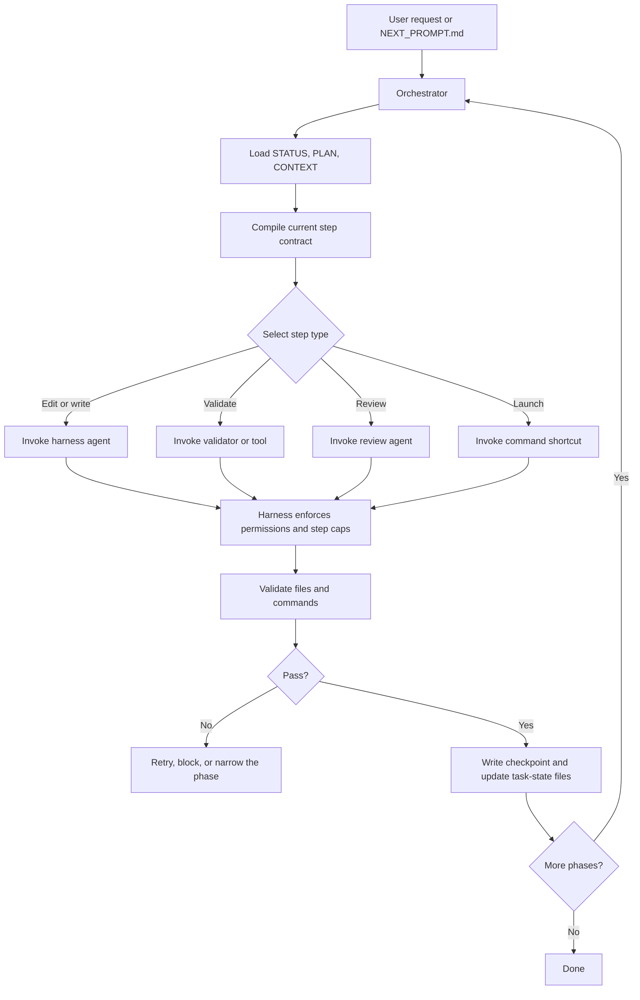

# Orchestrator and Harness: How Implementation Plans Run

> **Superseded.** This is an early draft. The authoritative version is at `deep_determinism/orchestrator_and_harness.md` — it has the same content enriched with HarnessAdapter ABC, StepContract/HarnessResult dataclasses, HarnessRegistry, OpenCode adapter specifics, and subprocess timeout enforcement.

Use this note when thinking through how ContextSmith should execute a phased implementation plan from a `NEXT_PROMPT.md` handoff. The orchestrator owns the workflow, while the harness executes each bounded step.

## The Big Idea

The orchestrator decides **what happens next**. The harness decides **how the step is executed**. The agent should never be responsible for holding the whole workflow in memory.

This split makes long runs more reliable:

- the orchestrator tracks state, retries, checkpoints, and phase transitions
- the harness enforces permissions, step limits, and validation hooks
- the agent performs one bounded task and writes artifacts to disk

The baseline workflow definition should live in YAML or JSON config so the orchestrator can enforce required steps even when a plan artifact is incomplete.

## What Each Layer Does

| Layer | Responsibility | Example |
|---|---|---|
| Orchestrator | Workflow graph, retries, resume, loop detection | Move from `audit` to `fix` only after validation passes |
| Harness | Agent execution, permissions, tool hooks, step caps | Run the audit agent with read-only access |
| Agent | One bounded task | Write audit findings to `audit.md` |
| Validators | Check outputs on disk | Verify required files and command exit codes |

## Example Input

A user might run something like:

```text
/contextsmith run the prompt in this file: /home/frank/00-Code/ContextSmith/.agent_work/sprints/runtime-enforcement/tasks/YYYY-mm-dd-runtime-enforcement/NEXT_PROMPT.md
```

That looks like a simple prompt, but behind the scenes it is a structured handoff. The system should treat it as a resumable workflow, not a one-off chat request.

## Behind the Scenes

1. The router selects `contextsmith-run`.
2. The run skill detects that the input is a task-state handoff.
3. The orchestrator loads `STATUS.md`, `PLAN.md`, and `CONTEXT.md`.
4. The orchestrator compiles the current phase contract.
5. The orchestrator selects the next state and matching harness profile.
6. The harness invokes the agent with permissions and step caps.
7. The agent writes files, not just chat output.
8. Validators check the artifacts.
9. The orchestrator records closeout state and writes the next handoff.
10. The workflow either advances, retries, or stops.

## Flowchart



## What Changes on Disk

For a phased implementation plan, the workflow should keep task state in `.agent_work/sprints/.../tasks/.../` and update it as it runs.

Typical files:

- `TASK.md` - objective, scope, constraints
- `PLAN.md` - phase checklist and validation gates
- `STATUS.md` - current phase and next action
- `CONTEXT.md` - known facts and file map
- `DECISIONS.md` - durable decisions and reasons
- `ARTIFACTS.md` - changed files and commands
- `PHASE_LOG.md` - compact phase history
- `NEXT_PROMPT.md` - next-phase handoff prompt

## Common Failure Modes

| Problem | Fix |
|---|---|
| Agent tries to hold the whole workflow in memory | Move workflow control into the orchestrator |
| Phase output is valid but workflow advances too early | Add a validator or tool gate |
| Agent loops on the same mistake | Add step caps and loop detection |
| Resume loses context after interruption | Persist state in task files and checkpoints |
| Harness allows unsafe actions | Tighten permissions or add a plugin hook |

## Where This Fits

This note complements the runtime enforcement docs:

- use `RUNTIME_ENFORCEMENT.md` for operational workflow rules
- use this note for the architecture of orchestrator + harness execution
- use `RUN_TASK_STATE_HANDOFF.md` for the current `NEXT_PROMPT.md` handoff flow
- use `workflow_config_sketch.md` for the baseline workflow config shape
- use `audit_and_ralph_state_machine.md` for enforced audit/Ralph loop behavior
- use `communications_protocol_sketch.md` for the message flow between orchestrator, harness, and agent
